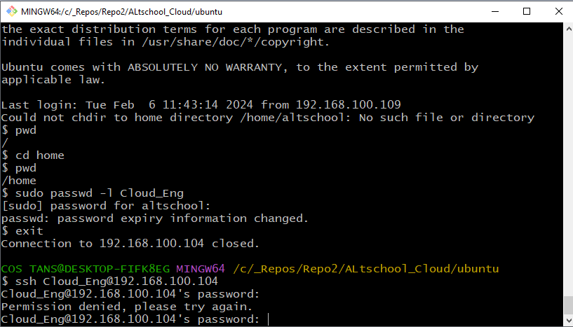

# ALT SCHOOL CLOUD ENGINEERING LIVE CLASS ASSIGNMENT 1

The Assignment tasks are as follows:

### Your login name: altschool i.e., home directory /home/altschool. The home directory contains the following sub-directories: code, tests, personal, misc Unless otherwise specified, you are running commands from the home directory.


1. Change directory to the tests directory using absolute pathname

1. Change directory to the tests directory using relative pathname

1. Use echo command to create a file named fileA with text content ‘Hello A’ in the misc directory

1. Create an empty file named fileB in the misc directory. Populate the file with a dummy content afterwards

1. Copy contents of fileA into fileC

1. Move contents of fileB into fileD

1. Create a tar archive called misc.tar for the contents of misc directory

1. Compress the tar archive to create a misc.tar.gz file

1. Create a user and force the user to change his/her password upon login

1. Lock a users password

1. Create a user with no login shell

1. Disable password based authentication for ssh

1. Disable root login for ssh

---

## SOLUTION TO THE TASKS

### Task intro

Your login name: altschool i.e., home directory /home/altschool. The home directory contains the following sub-directories: code, tests, personal, misc Unless otherwise specified, you are running commands from the home directory.

Soln:

```bash
sudo usermod -aG sudo altschool

# alternatively creates user altchool by login in to root directory
vagrant@ubuntu-focal:~$ sudo -i
root@ubuntu-focal:~# useradd altschool
root@ubuntu-focal:~# passwd altschool
New password:
Retype new password:
passwd: password updated successfully
root@ubuntu-focal:~# exit
logout
vagrant@ubuntu-focal:~$ exit
logout

#login user

ssh altschool@192.168.100.104

# list contents to confirm presence of home directory
ls

cd home

# creates the directories code, tests, personel and misc on home directory
mkdir code tests personal misc

#to confirm successful creation of directories
ls

```


---

### Change directory to the tests directory using absolute pathname

```bash

$ cd /home/tests

$ pwd
/home/tests

# go back to home directory
cd ..

```
---

### Change directory to the tests directory using relative pathname

```bash

$ pwd
/home
$ ls
code  misc  personal  tests  ubuntu  vagrant

$ cd tests

$ pwd
/home/tests

# go back to home directory
cd ..

```
---

### Use echo command to create a file named fileA with text content ‘Hello A’ in the misc directory

```bash
# creates fileA in misc directory from the home directory using elevated privileges
sudo sh -c 'echo "Hello A" > /home/misc/fileA.txt'

```
---

### Create an empty file named fileB in the misc directory. Populate the file with a dummy content afterwards

```bash

# creates the emoty file
sudo touch /home/misc/fileB.txt

# This command populates the empty file with some content
echo "https://www.youtube.com/watch?v=MlIzFUI1QGA" | sudo tee /home/misc/fileB.txt

```
---

### Copy contents of fileA into fileC

```bash

sudo cp /home/misc/fileA.txt /home/misc/fileC.txt

```
---

### Move contents of fileB into fileD

```bash

sudo mv /home/misc/fileB.txt /home/misc/fileD.txt

```
---

### Create a tar archive called misc.tar for the contents of misc directory

```bash

sudo tar -cvf /home/misc/misc.tar -C /home misc

# to view the archive use this command

tar -tf /home/misc/misc.tar

```
---

### Compress the tar archive to create a misc.tar.gz file

```bash

sudo tar -czvf /home/misc/misc.tar.gz -C /home misc

```
---

### Create a user and force the user to change his/her password upon login

```bash

# Create a new user:
sudo useradd -m -s /bin/bash Cloud_Eng

# Set an initial password for the user:
sudo passwd Cloud_Eng


# Force the user to change their password upon the first login:
sudo chage -d 0 Cloud_Eng

# try login with user
ssh Cloud_Eng@192.168.100.104

```


---

### Lock a users password

```bash

# lock the user's password

sudo passwd -l Cloud_Eng


# To unlock the password, you can use the -u option:

sudo passwd -u Cloud_Eng

```



---

### Create a user with no login shell

```bash

sudo useradd -s /usr/sbin/nologin Frontend_Eng

```

---

### Disable password based authentication for ssh

```bash

sudo vi /etc/ssh/sshd_config

or

sudo nano /etc/ssh/sshd_config

# Change the "yes" to "no" as shown on the image and then run the command below to activate

sudo service ssh restart

```


---

### Disable root login for ssh

```bash

sudo vi /etc/ssh/sshd_config

or

sudo nano /etc/ssh/sshd_config


# Change the option to "no" as shown on the image below and then run the command below to activate

sudo service ssh restart

```


---


